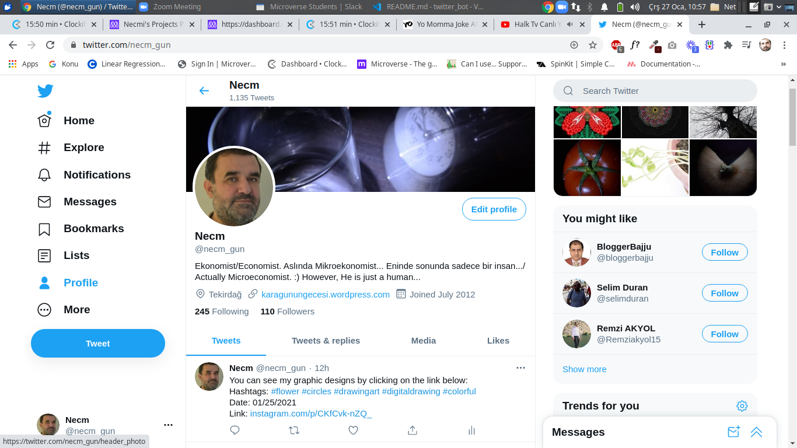

# Twitter_Bot

This is a twitter bot made with Ruby for the Microverse Capstone project of the Ruby module. This bot parses information from a rss page which is a converted version of a personal Instagram page and tweets them every twelve hours. 

## Instructions

This bot has one functionality:`POST_TWEETS`

* `POST_TWEETS`
- The bot gets some parts from a RSS (Conversion of a personal instagram page into a RSS page), and tweets them once every twelve hours

## Built With

- Ruby

For running the bot locally, you need to switch to ruby -v 2.7.2 if you use another version of ruby such as ruby -v 3.0.0 .

## Prerequisties

- Ruby
- Twitter gem
- Dotenv gem
- HTTParty gem
- RSS gem

## Getting Started

To get a local copy up and running follow these simple example steps in your terminal.

- `https://github.com/necmigunduz/twitter_bot`
- `cd twitter_bot`
- `ruby bin/update.rb`

Following these steps, create an .env file in the root folder and place keys and tokens for Twitter as follows: 

consumer_key = 'Enter your consumer_key here'
consumer_secret     = 'Enter your consumer_secret here'
access_token        = ''Enter your access_token here''
access_token_secret = ''Enter your access_token_secret here''

For tweeting your posts in your personal Instagram account, your need to replace the url in the tweet method with your rss page url in the ins_taweet.rb in lib. To convert your Instagram page into a rss page, you can use rss.app service or another rss conversion service. 

## Testing

To test you have to install the RSpec gem and run this command from the root folder:

- `rspec`

For running the test, enter the name of the test in test_name area, and run the code below:

-`rspec spec/test_name`

While testing the methods of InsTaweet class, you need to delete private above access method.

## Author

👤 **Necmi Gunduz**

- GitHub: [@necmigunduz](https://github.com/necmigunduz)
- Twitter: [@necm_gun](https://twitter.com/necm_gun)
- LinkedIn: [LinkedIn](https://www.linkedin.com/in/necmigunduz/)

## 🤝 Contributing

Contributions, issues, and feature requests are welcome!

## Show your support

Give a ⭐️ if you like this project!

## 📝 License

Copyright 2021 Necmi Gunduz

Permission is hereby granted, free of charge, to any person obtaining a copy of this software and associated documentation files (the "Software"), to deal in the Software without restriction, including without limitation the rights to use, copy, modify, merge, publish, distribute, sublicense, and/or sell copies of the Software, and to permit persons to whom the Software is furnished to do so, subject to the following conditions:

The above copyright notice and this permission notice shall be included in all copies or substantial portions of the Software.

THE SOFTWARE IS PROVIDED "AS IS", WITHOUT WARRANTY OF ANY KIND, EXPRESS OR IMPLIED, INCLUDING BUT NOT LIMITED TO THE WARRANTIES OF MERCHANTABILITY, FITNESS FOR A PARTICULAR PURPOSE AND NONINFRINGEMENT. IN NO EVENT SHALL THE AUTHORS OR COPYRIGHT HOLDERS BE LIABLE FOR ANY CLAIM, DAMAGES OR OTHER LIABILITY, WHETHER IN AN ACTION OF CONTRACT, TORT OR OTHERWISE, ARISING FROM, OUT OF OR IN CONNECTION WITH THE SOFTWARE OR THE USE OR OTHER DEALINGS IN THE SOFTWARE.